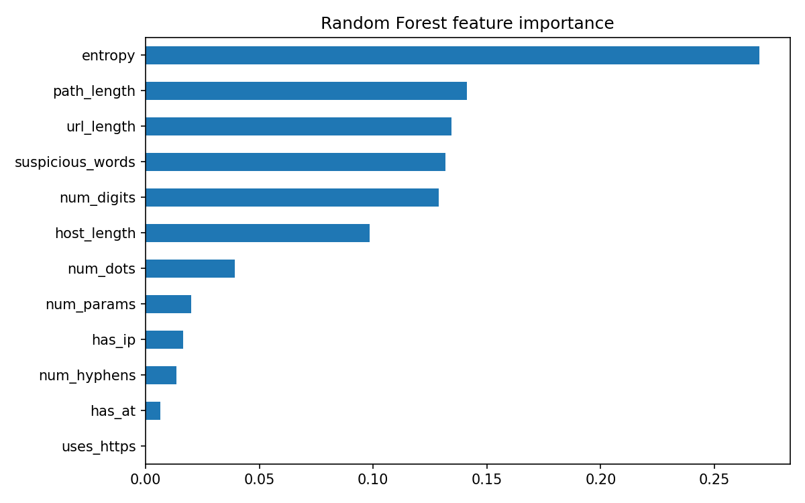

# phishing-url-classifier

This is a machine learning project that classifies URLs as phishing or legitimate using only features extracted from the URL text. It never visits the links.

## Dataset used 
[Phishing Site URLs, https://www.kaggle.com/datasets/taruntiwarihp/phishing-site-urls], using [50000] URLs, of which [22.5]% are phishing.

## Method
- Extracted 12 features per URL, such as length, number of dots and hyphens, entropy, presence of an IP address or "@", and suspicious keywords
- Trained a Random Forest and compared it against a Logistic Regression baseline
- 80/20 stratified train/test split

The dataset is imbalanced (22.5% phishing), so I evaluated with precision, recall and F1 on the phishing class instead of just relying on accuracy.

We can further see the accuracy with the Confusion Matrix
URLs that are actually legitimate: 7339
URLs that are legitimate but flaged as phishin: 416
URLs that the model missed: 934
URLs that are phishing: 1311

|   Model   |   Precision   |   Recall  |   F1  |
| Logistic Regression | 0.90 | 0.33 | 0.48 |
| Random Forest | 0.76 | 0.58 | 0.66 |

(Metrics shown for the phishing class.)

The Logistic Regression improved the Precision by 0.14.
The Random Forest improved the Recall by 0.25.
The Random Forest improved the F1 by 0.18.

The longest bars are the features the model relied on most.
So the top three are entropy scoring the highest followed by path_length and then url_length

The reason some of the phishing websites were misclassified using my model are because:
1. Most URLs are short and clean domains without any odd characters, such as tengalo.com, cvilleshirtco.com
   and rentvspb.ru. Because of that my model mostly meaasures how "messy" a URL looks for example length, digits, entropy and sorts, so URLs that look clean would slip past.

2. There is also a possibility that the websites have been hacked or hosted. These sites are mostly smaller business domains like cvilleshirtco.com, mazatlanapartments.com and btpcadres.com which are legitimate sites that were hacked and use to host phishing pages. Meaning that the domains are real and only the path are malicious.

3. Brand names in the path that my keyword list misses. ce-adobe.fr/paypal_compte.html and audiconlex.cl/us/paypal/ are classic phishing patterns, but "paypal" isn't in my suspicious_words list, so the model couldn't see it.

4. Big, legitimate sites. udn.epicgames.com and uncyclopedia.wikia.com look like real sites that were probably flagged wrongly. Long paths and subdomains can make legitimate URLs look suspicious to the model.

5. Nothing in the URL text alone reveals the danger. That's the core limitation of a URL-only model.

## Limitations
- Scores may be inflated by dataset quirks such as duplicate patterns or a single data source
- Attackers can evade URL-only models with clean-looking domains, so this shouldn't be the only defence
- Not tested on real-world traffic

## Run it yourself
    git clone https://github.com/2CheesBurger/phishing-url-classifier.git
    cd phishing-url-classifier
    python3 -m venv venv
    source venv/bin/activate
    pip install -r requirements.txt
    python3 phishing_classifier.py

Place the dataset CSV at data/urls.csv (see Dataset above).